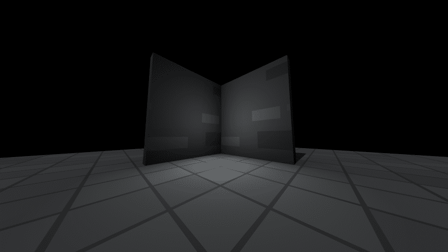
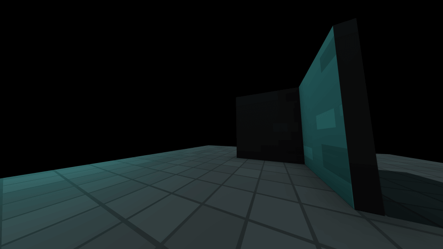
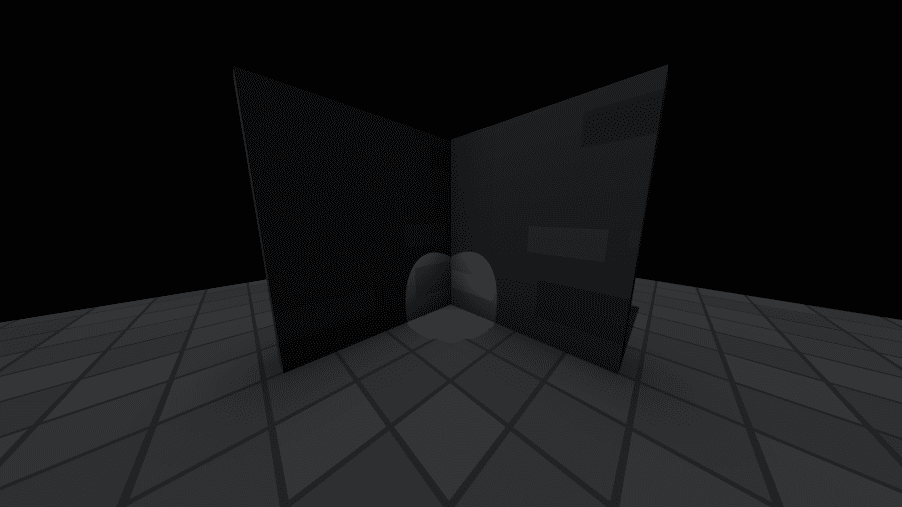
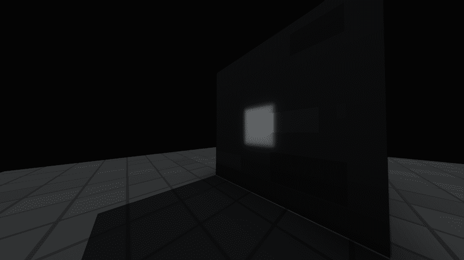
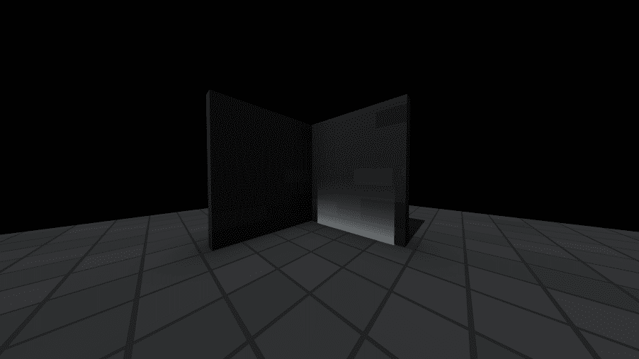

## Introduction

Unless you are creating a 2D Game on the [Overlay Canvas](./files/rendering_2d?id=overlay-canvas), you will most likely utilize the 3D Scene in some way.

<br><br/>

## Structure

A basic 3D Scene comprises of a Skybox, a [Camera](./files/cameras) and a few Objects. There are a few extra components to help you further customize the look of your scene.

<br><br/>

## Components

Components that make up the overall look of your scene:

**Sky Color:** Scene background color. Can be a solid color or a 3 tier gradient.

```krunkscript
GAME.SCENE.setSkyColor(
    "#fff" # str color
);
```

---

**Sky Dome:** Scene background dome. Can be a 3 tier gradient with texture.

```krunkscript
GAME.SCENE.setSkyDome(
    "#fff", # str color1
    "#fff", # str color2
    "#fff", # str color3
    data # obj additional data
);

# all fields are optional
obj additional = {
    texture: "assetID",
    emissive: "#ff0000",
    emissiveTexture: "assetID",
    textureMoveAxis: 0 or 1 - "x" or "y",
    textureMoveSpeed: -20 to 20
};
# additional data is passed into the setSkyDome

# removing skydome
GAME.SCENE.removeSkyDome();
```

---

**Sky Light:** Sky light color and position (casts shadows).

```krunkscript
GAME.SCENE.setSkyLight(
    "#fff", # str color
    2, # num light intensity (0 - 3)
    sunAngX, # num sun angle x (0 - 360)
    sunAngY, # num sun angle y (0 - 360)
    100 # num light distance (10 - 15000)
);
```

___

**Ambient Light:** Scene ambient light (indirect light).

```krunkscript
GAME.SCENE.setAmbientLight(
    "#fff", # str color
    2 # num light intensity (0 - 3)
);
```

___

**Fog:** Scene fog color & density. Used to fade objects to a color at a distance

<p class="hidep"><strong class="client-side">client-side</strong></p>

```krunkscript
GAME.SCENE.setFog(
    "#fff", # str color
    100 # num fog distance
);
```

___

**Terrain:** Limited seed based terrain implementation.
___

**Ocean:** Reflective & customizable ocean component

___

Some of these components may be limited in terms of functionality.

<br><br/>

## Environments

A scene can feature several environments.\
An environment is made up of a few components:

- **Sky Box**
- **Sky Light**
- **Ambient Light**
- **Ambient Sound**
- **Fog**

Each of those components contributes to making the scene feel more alive.\
In order to have multiple environments in your scene, use an **Environment Zone**.\
The active environment depends on which environment zone the camera is currently in.\
You can also get the active environment zone via **KrunkScript:**

```krunkscript
# get active environment zone index
num activeZone = (num) GAME.CAMERA.envZone; # index or -1 if in default
```

<br><br/>

## Lights

Light Objects can be used to add more ambience to your scene.\
Use them sparingly however as they can cause performance issues.\
The different light types you can add to your scene are:

___

**Point Light:** Emits light equally in all directions from a point (Bulb, Candle, Flame etc).



**Add using KrunkScript:**

<p class="hidep"><strong class="client-side">client-side</strong></p>

```krunkscript
obj lamp = GAME.SCENE.addPointLight(
    "#fff", # str color
    0,      # num x position
    0,      # num y position
    0,      # num z position
    50,     # num range
    0.1     # num falloff
    false   # bool castShadow
);
```

___

**Directional Light:** Emits light in a specific direction in world space (Sun)



**Add using KrunkScript:**

<p class="hidep"><strong class="client-side">client-side</strong></p>

```krunkscript
obj sun = GAME.SCENE.addDirLight(
    "#fff", # str color
    0,      # num x direction
    0,      # num y direction
    0       # num z direction
    false   # bool castShadow
);
```

___

**Spot Light:** Emits light in a specfici direction from a point (Flashlight, Projector etc)



**Add using KrunkScript:**

<p class="hidep"><strong class="client-side">client-side</strong></p>

```krunkscript
obj flashlight = GAME.SCENE.addSpotLight(
    "#fff", # str color
    0,      # num x position
    20,     # num y position
    0,      # num z position
    0,      # num x target pos
    0,      # num y target pos
    0,      # num z target pos
    50,     # num range
    0.1,    # num decay
    1,      # num intensity
    0,      # num angle (degrees)
    0,      # num penumbra
    false,  # bool castShadow
);
```

___

**Rectarea Light:** Emits light from a rectangular area (Windows, Screens etc)



**Add using KrunkScript:**

<p class="hidep"><strong class="client-side">client-side</strong></p>

```krunkscript
obj window = GAME.SCENE.addRectLight(
    "#fff", # str color
    0, # num x position
    0, # num y position
    0, # num z position
    1, # num width
    1, # num height
    1 # num length
);
```

___

You can create a more performant alternative to lights by adding image based light objects:

___

**Light Cone:** Gradient cone object with emissive texture


___

**Light Bar:** Gradient plane object with emissive texture



___
Depending on your desired effect and performance requirements, you may choose to bake your lighting in an external software and to import the finished scene as an asset.
___

For updating/moving lights, refer to the [Moving, Rotating & Scaling](./files/scene?id=moving-rotating-amp-scaling) section.\
Please note that lights require you to use a Lighting setting higher than default.

<br><br/>

## Adding 3D Objects

Additionally there are several other object types that you can add to your scene.

Objects can be added via KrunkScript or in the Editor:

```
```

To learn how to add/sync an object on the Client and Server, please refer to the [Multiplayer & Networking](./files/multiplayer_&_networking) section.

---

When adding an object to your scene, you can include **additional data** to further customize your object:

```krunkscript
# all fields are optional
obj additional = {

    # Works on all object types:
    opacity: 0.5,
    emissive: "#ff0000",
    forceTransparency: true/false,
    side: 0 to 2,
    doubleSided: true/false,
    frontSided: true/false,
    backSided: true/false,
    textureStretching: true/false,
    textureScale: 0.00 to 10.00,
    textureMoveAxis: 0 or 1 - 'x' or 'y',
    textureMoveSpeed: -20 to 20,
    textureOffsetX: 0.00 to 1.00,
    textureOffsetY: 0.00 to 1.00,
    textureRotation: 0 to 360,
    textureEncoding: 0 to 9, # Linear, sRGB, Gamma, RGBE, LogLuv RGBM7, RGBM16, RGBD, BasicDepthPacking, RGBADepthPacking
    textureFrameCount: 0 to 10,
    textureFrameDuration: 0 to 10,

    # Plane Only:
    mimicSprite: true/false,

    # Asset Only:
    textureSmoothing: true/false,
    spinSpeed: -20 to 20,
    spinAxis: 0 or 1 - x or y,
    animSpeed: 0.01 to 10.00,
    animStart: "Idle", # starting clip name
    alwaysRender: true/false,
    alphaTest: 0.00 to 1.00
};

# additional data is passed into the addCube, addAsset functions
```

___

**3D Models:** Custom 3D Assets. Currently supported formats: .obj & .gltf.\
View the [Custom Assets](./files/custom_assets) section for more information on adding them to your scene.

___

**Cubes:** 3D Cubes (Texture, Color, Scale, Rotation, Position)

<p class="hidep"><strong class="client-side">client-side</strong></p>

```krunkscript
# add via KrunkScript
obj cube = GAME.SCENE.addCube(
    src, # str texture asset id
    colr, # str color
    x, # num x position
    y, # num y position
    z, # num z position
    w, # num width
    h, # num height
    l, # num length
    data # obj additional data
);
```

___

**Planes:** Flat 3D Plane (Texture, Color, Scale, Rotation, Position)

<p class="hidep"><strong class="client-side">client-side</strong></p>

```krunkscript
# add via KrunkScript
obj plane = GAME.SCENE.addPlane(
    src, # str texture asset id
    colr, # str color
    x, # num x position
    y, # num y position
    z, # num z position
    w, # num width
    l, # num length
    data # obj additional data
);
```

---

**Spheres:** 3D Sphere (Texture, Color, Scale, Position)

<p class="hidep"><strong class="client-side">client-side</strong></p>

```krunkscript
# add via KrunkScript
obj sphere = GAME.SCENE.addSphere(
    src, # str texture asset id
    colr, # str color
    x, # num x position
    y, # num y position
    z, # num z position
    w, # num width
    h, # num height
    l, # num length
    data # obj additional data
);
```

___

**Sprites:** 3D Object always facing the camera. Can be used for particles or distant low detail objects.

<p class="hidep"><strong class="client-side">client-side</strong></p>

```krunkscript
# add via KrunkScript
obj sprite = GAME.SCENE.addSprite(
    src, # str texture asset id
    colr, # str color
    x, # num x position
    y, # num y position
    z, # num z position
    s, # num scale
    data # obj additional data
);
```

---

**Custom Generated Model:** Generated from Float32 list of vertices

<p class="hidep"><strong class="client-side">client-side</strong></p>

```krunkscript
# add via KrunkScript
obj plane = GAME.SCENE.addCustom(
    aid, # str asset id
    colr, # str color
    verts, # Float32Array of Vertices
    x, # num x position
    y, # num y position
    z, # num z position
    w, # num width
    h, # num height
    l, # num length
    data # obj additional data
);
```

___

**Triggers:** Allows for creation of logic without scripting. [More info](./files/trigger_logic)

___

**Placeholders:** Placeholders used for Grouping or Importing objects in your scene.
___

You can also import custom assets to your game, if the default objects don't fulfill your needs.


<br><br/>

## Removing 3D Objects

You can clear your 3D scene by using KrunkScript:

<p class="hidep"><strong class="client-side">client-side</strong></p>

```krunkscript
# add object
obj cube = GAME.SCENE.addCube("", "#fff", 0, 0, 0, 10, 10, 10, {
    opacity: 0.5
});

# remove specific object from scene:
cube.delete();

# clear scene
GAME.SCENE.clear(); # removes all objects in scene
```

<br><br/>

## Attaching/Detaching 3D Objects

You can attach objects to other 3D objects:

<p class="hidep"><strong class="client-side">client-side</strong></p>

```krunkscript
# create object
obj cube = GAME.SCENE.addCube("", "#fff", 0, 0, 0, 10, 10, 10, {
    opacity: 0.5
});

# attach cube to camera
cube.attachTo(GAME.CAMERA.getObj(), 0, 0, 0);

# attach cube to other object:
cube.attachTo(otherObj, 0, 0, 10);

# attach cube to a player:
cube.attachTo(player, 0, 0, 0);

# attach cube at its current location (at Origin):
cube.attachTo(player, 0, 0, 0, true);

# you can detach an object in the same way:
cube.detach();
```

<br><br/>

## Coordinate System

Coordinates in 2D and 3D space are represented as x, y and x, y, z:

<p class="hidep"><strong class="client-side">client-side</strong></p>

```krunkscript
# X: left-right
# Y: up-down
# Z: backward-forward
```

You can convert 3D coordinates into 2D (screen-space) using KrunkScript:

```krunkscript
# get screen-space coords
obj coords2D = GAME.SCENE.posToScreen(0, 10, 0);
# use coords to render to screen
(num) coords2D.x;
(num) coords2D.y;
# you can check if those coordinates or on the screen:
(bool) coords2D.onScreen; # true/false
```

This is useful for adding 2D Overlays to objects such as: Healthbars, Text-tags, etc.

<br><br/>

## Path Nodes

Path/Coordinate 3D objects that can be added by hand and interacted with using KrunkScript:

```krunkscript
# fetch nodes list
obj[] nodes = GAME.OBJECTS.getPathNodes();
for (num i = 0; i < lengthOf nodes; ++i) {
    # access unique id
    (num) nodes[i].id;

    # access coordinates
    (num) nodes[i].x;
    (num) nodes[i].y;
    (num) nodes[i].z;
}
```

This is useful for creating basic path-findingg or accessing coordinates.

<br><br/>

## Moving, Rotating & Scaling

Any 3D Object can be moved, rotated or scaled:


___

**Using KrunkScript:** (This works on all object types)

<p class="hidep"><strong class="client-side">client-side</strong></p>

```krunkscript
# create cube object
obj cube = GAME.SCENE.addCube(
    "", # no texture
    "#fff", # white color
    0, # x
    0, # y
    0, # z
    10, # width
    10, # height
    10 # length
);

# moving objects variants
cube.move(0, 0, 0); # set cube position
(num) cube.position.x += 1; # move cube on x-axis
GAME.SCENE.movObj(cube, 0, 1, 0); # move cube via action
cube.position.x = 10; # set object x position

# scale objects
cube.scale.x = 5; # scale cube on x-axis
GAME.SCENE.scaleObj(cube, 5, 1, 1); # scale cube via action

# rotate objects variants
cube.rotate(0, 0, Math.PI);
cube.rotation.x = Math.PI; # rotate cube on x-axis
GAME.SCENE.rotObj(cube, 0, 0, Math.PI); # rotate cube via action

# look at point
cube.lookAt(0, 0, 0);
```

If you want to move an object across the server and all clients, please refer to the [Multiplayer & Networking](./files/multiplayer_&_networking) section.

<br><br/>

## Object Visibility

Any 3D Object can be hidden using KrunkScript:

<p class="hidep"><strong class="client-side">client-side</strong></p>

```krunkscript
# hide cube object
obj cube = GAME.SCENE.addCube("", "#fff", 0, 0, 0, 10, 10, 10);
cube.visible = false; # hide cube
```

<br><br/>

## Sounds

For information relating to loading and playing custom sounds, please refer to the [Sounds & Music](./files/custom_assets?id=sounds-amp-music) section.